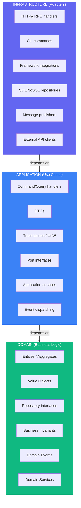

# Quick Reference Cheatsheet (Go)

> See [SKILL.md](../SKILL.md#sources) for full source list.

## Layer Summary



*Dependencies point inward*

---

## Quick Decision Trees

### "Where does this code go?"

```text
Is it a business rule or invariant?
├── YES -> Domain
└── NO

Is it orchestrating a use case?
├── YES -> Application
└── NO

Is it talking to DB/network/framework?
├── YES -> Infrastructure
└── NO -> Re-check the model
```

### "Entity or Value Object?"

```text
Has stable identity over time?
├── YES -> Entity
└── NO

Defined only by attributes?
├── YES -> Value Object
└── NO -> Probably Entity
```

### "Aggregate boundary?"

```text
Must they change atomically together?
├── YES -> Same aggregate
└── NO

Can they be eventually consistent?
├── YES -> Different aggregates (reference by ID)
└── NO -> Probably same aggregate
```

### "Domain Service or Entity method?"

```text
Naturally belongs to one entity?
├── YES -> Entity method
└── NO

Needs multiple aggregates or policies?
├── YES -> Domain Service
└── NO -> Revisit placement
```

---

## Common Patterns Quick Reference

### Value Object Template (Go)

```go
package money

import "fmt"

type Money struct {
	amount   int64 // cents
	currency string
}

func New(amount int64, currency string) (Money, error) {
	if amount < 0 {
		return Money{}, fmt.Errorf("money: negative amount")
	}
	if currency == "" {
		return Money{}, fmt.Errorf("money: empty currency")
	}
	return Money{amount: amount, currency: currency}, nil
}

func Zero(currency string) Money { return Money{currency: currency} }

func (m Money) Add(other Money) (Money, error) {
	if m.currency != other.currency {
		return Money{}, fmt.Errorf("money: currency mismatch")
	}
	return Money{amount: m.amount + other.amount, currency: m.currency}, nil
}

func (m Money) Equals(other Money) bool {
	return m.amount == other.amount && m.currency == other.currency
}
```

### Entity Template (Go)

```go
package order

import "github.com/google/uuid"

type OrderItemID string

type OrderItem struct {
	id        OrderItemID
	productID string
	quantity  int
}

func NewOrderItem(productID string, quantity int) (OrderItem, error) {
	if quantity <= 0 {
		return OrderItem{}, ErrInvalidQuantity
	}
	return OrderItem{
		id:        OrderItemID(uuid.NewString()),
		productID: productID,
		quantity:  quantity,
	}, nil
}

func (i *OrderItem) IncreaseQuantity(delta int) error {
	if delta <= 0 {
		return ErrInvalidQuantity
	}
	i.quantity += delta
	return nil
}
```

### Aggregate Root Template (Go)

```go
package order

import "time"

type Status string

const (
	StatusDraft     Status = "draft"
	StatusConfirmed Status = "confirmed"
	StatusCancelled Status = "cancelled"
)

type Order struct {
	id      string
	status  Status
	items   []OrderItem
	events  []Event
	created time.Time
}

func NewOrder(id string) *Order {
	o := &Order{id: id, status: StatusDraft, created: time.Now().UTC()}
	o.addEvent(OrderCreated{OrderID: id})
	return o
}

func (o *Order) AddItem(productID string, quantity int) error {
	if o.status == StatusCancelled {
		return ErrInvalidState
	}
	item, err := NewOrderItem(productID, quantity)
	if err != nil {
		return err
	}
	o.items = append(o.items, item)
	return nil
}

func (o *Order) Confirm() error {
	if len(o.items) == 0 {
		return ErrEmptyOrder
	}
	o.status = StatusConfirmed
	o.addEvent(OrderConfirmed{OrderID: o.id})
	return nil
}
```

### Repository Interface Template (Go)

```go
package order

import "context"

type Repository interface {
	FindByID(ctx context.Context, id string) (*Order, error)
	Save(ctx context.Context, order *Order) error
	Delete(ctx context.Context, id string) error
}
```

### Use Case Handler Template (Go)

```go
package placeorder

import "context"

type Handler struct {
	orderRepo   OrderRepository
	productRepo ProductRepository
	publisher   EventPublisher
}

func (h Handler) Execute(ctx context.Context, cmd Command) (string, error) {
	order := NewOrder(newID())
	for _, it := range cmd.Items {
		p, err := h.productRepo.FindByID(ctx, it.ProductID)
		if err != nil {
			return "", err
		}
		if err := order.AddItem(p.ID, it.Quantity); err != nil {
			return "", err
		}
	}
	if err := h.orderRepo.Save(ctx, order); err != nil {
		return "", err
	}
	if err := h.publisher.PublishAll(ctx, order.PullEvents()); err != nil {
		return "", err
	}
	return order.ID(), nil
}
```

---

## Port Naming Conventions (Go)

| Type | Pattern | Examples |
|------|---------|----------|
| Driver Port | `{Action}UseCase` | `PlaceOrderUseCase`, `GetOrderUseCase` |
| Driven Port | `{Resource}Repository` | `OrderRepository`, `ProductRepository` |
| Driven Port | `{Action}Service` | `PaymentService`, `NotificationService` |
| Driven Port | `{Resource}Gateway` | `PaymentGateway`, `ShippingGateway` |

Prefer Go style: avoid `I` prefix.

---

## Common Anti-Patterns

| Anti-Pattern | Problem | Solution |
|--------------|---------|----------|
| Anemic Domain | Entities as data bags | Put rules in entities/aggregates |
| Repository per table | Breaks aggregate boundaries | One repo per aggregate |
| Fat handlers | Business logic in use case layer | Move invariants to domain |
| Domain importing infra | Tight coupling | Keep domain pure Go |
