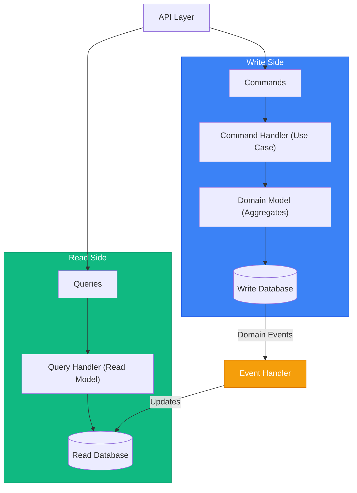

# CQRS & Domain Events (Go)

> Sources:
> - [CQRS](https://martinfowler.com/bliki/CQRS.html) — Martin Fowler
> - [Event Sourcing](https://martinfowler.com/eaaDev/EventSourcing.html) — Martin Fowler
> - [CQRS Pattern](https://learn.microsoft.com/en-us/azure/architecture/patterns/cqrs) — Microsoft Azure
> - [Transactional Outbox](https://microservices.io/patterns/data/transactional-outbox.html) — microservices.io
> - [Domain Events – Salvation](https://udidahan.com/2009/06/14/domain-events-salvation/) — Udi Dahan
> - [Strengthening Your Domain: Domain Events](https://lostechies.com/jimmybogard/2010/04/08/strengthening-your-domain-domain-events/) — Jimmy Bogard
> - [Domain Events: Design and Implementation](https://learn.microsoft.com/en-us/dotnet/architecture/microservices/microservice-ddd-cqrs-patterns/domain-events-design-implementation) — Microsoft

## CQRS Overview

CQRS separa modelos de escritura (commands) y lectura (queries).



---

## Commands vs Queries

### Commands (Write Side)

Mutan estado.

```go
package write

import "context"

type PlaceOrderCommand struct {
	CustomerID string
	Items      []PlaceOrderItem
}

type ConfirmOrderCommand struct {
	OrderID string
}

type CancelOrderCommand struct {
	OrderID string
	Reason  string
}

type PlaceOrderHandler struct {
	orders    OrderRepository
	products  ProductRepository
	publisher EventPublisher
}

func (h PlaceOrderHandler) Handle(ctx context.Context, cmd PlaceOrderCommand) (string, error) {
	order := domain.NewOrder(newID(), cmd.CustomerID)
	for _, item := range cmd.Items {
		p, err := h.products.FindByID(ctx, item.ProductID)
		if err != nil {
			return "", err
		}
		if err := order.AddItem(p.ID, domain.NewQuantity(item.Quantity), p.Price); err != nil {
			return "", err
		}
	}
	if err := h.orders.Save(ctx, order); err != nil {
		return "", err
	}
	if err := h.publisher.PublishAll(ctx, order.PullEvents()); err != nil {
		return "", err
	}
	return order.ID(), nil
}
```

### Queries (Read Side)

No mutan estado.

```go
package read

import "context"

type GetOrderQuery struct {
	OrderID string
}

type GetOrdersByCustomerQuery struct {
	CustomerID string
	Status     string
	Page       int
	PageSize   int
}

type OrderDTO struct {
	ID           string
	CustomerID   string
	CustomerName string
	Status       string
	Items        []OrderItemDTO
	TotalCents   int64
	Currency     string
	CreatedAt    string
	ConfirmedAt  *string
}

type GetOrderHandler struct{ readDB OrderReadModel }

func (h GetOrderHandler) Handle(ctx context.Context, q GetOrderQuery) (*OrderDTO, error) {
	return h.readDB.FindByID(ctx, q.OrderID)
}
```

---

## Read Model (Projection)

Modelo optimizado para consulta (desnormalizado si aporta rendimiento).

```go
package read

import "context"

type OrderReadModel interface {
	FindByID(ctx context.Context, orderID string) (*OrderDTO, error)
	FindByCustomer(ctx context.Context, customerID, status string, page, pageSize int) (Paginated[OrderDTO], error)
	Search(ctx context.Context, criteria SearchCriteria) ([]OrderDTO, error)
}
```

---

## Domain Events

Señales de que algo ocurrió en el dominio.

```go
package domain

import "time"

type DomainEvent interface {
	EventID() string
	EventType() string
	AggregateID() string
	OccurredAt() time.Time
}

type baseEvent struct {
	id          string
	aggregateID string
	occurredAt  time.Time
}

func (e baseEvent) EventID() string      { return e.id }
func (e baseEvent) AggregateID() string  { return e.aggregateID }
func (e baseEvent) OccurredAt() time.Time { return e.occurredAt }

type OrderCreated struct {
	baseEvent
	OrderID    string
	CustomerID string
}

func (OrderCreated) EventType() string { return "order.created" }

type OrderConfirmed struct {
	baseEvent
	OrderID string
	Total   Money
	Items   []OrderItemSnapshot
}

func (OrderConfirmed) EventType() string { return "order.confirmed" }
```

### Event Handlers

```go
package handlers

import "context"

type OrderCreatedHandler struct{ readDB OrderReadStore }

func (h OrderCreatedHandler) Handle(ctx context.Context, e domain.OrderCreated) error {
	return h.readDB.InsertDraftOrder(ctx, e.OrderID, e.CustomerID, e.OccurredAt())
}

type OrderConfirmedHandler struct{ readDB OrderReadStore }

func (h OrderConfirmedHandler) Handle(ctx context.Context, e domain.OrderConfirmed) error {
	return h.readDB.MarkConfirmed(ctx, e.OrderID, e.Total, e.OccurredAt())
}
```

---

## Domain Events vs Integration Events

### Domain Events

- Internos al bounded context
- Más granulares
- Lenguaje del dominio

```go
package domain

type OrderItemQuantityIncreased struct {
	baseEvent
	OrderID     string
	ProductID   string
	OldQuantity int
	NewQuantity int
}

func (OrderItemQuantityIncreased) EventType() string { return "order.item.quantity.increased" }
```

### Integration Events

- Cruzan bounded contexts
- Más estables y versionados
- Contrato explícito

```go
package integration

type OrderConfirmedV1 struct {
	EventType string                   `json:"eventType"`
	EventID   string                   `json:"eventId"`
	Version   string                   `json:"version"`
	OccurredAt string                  `json:"occurredAt"`
	Payload   OrderConfirmedV1Payload  `json:"payload"`
}

type OrderConfirmedV1Payload struct {
	OrderID       string                   `json:"orderId"`
	CustomerID    string                   `json:"customerId"`
	Total         MoneyDTO                 `json:"total"`
	Items         []OrderConfirmedItemDTO  `json:"items"`
	ShippingAddress *AddressDTO            `json:"shippingAddress,omitempty"`
}
```

### Publishing Integration Events

```go
package handlers

import "context"

type PublishOrderConfirmed struct {
	broker MessageBroker
	orders OrderRepository
}

func (h PublishOrderConfirmed) Handle(ctx context.Context, e domain.OrderConfirmed) error {
	order, err := h.orders.FindByID(ctx, e.OrderID)
	if err != nil || order == nil {
		return err
	}
	msg := integration.OrderConfirmedV1{
		EventType: "sales.order.confirmed",
		EventID:   newID(),
		Version:   "1.0",
		OccurredAt: time.Now().UTC().Format(time.RFC3339),
		Payload:   mapFromOrder(order),
	}
	return h.broker.Publish(ctx, "order-events", msg)
}
```

---

## Event Dispatcher Pattern

```go
package events

import (
	"context"
	"sync"
)

type Handler interface {
	Handle(ctx context.Context, event domain.DomainEvent) error
}

type Dispatcher struct {
	mu       sync.RWMutex
	handlers map[string][]Handler
}

func NewDispatcher() *Dispatcher {
	return &Dispatcher{handlers: map[string][]Handler{}}
}

func (d *Dispatcher) Register(eventType string, h Handler) {
	d.mu.Lock()
	defer d.mu.Unlock()
	d.handlers[eventType] = append(d.handlers[eventType], h)
}

func (d *Dispatcher) Dispatch(ctx context.Context, e domain.DomainEvent) error {
	d.mu.RLock()
	hs := append([]Handler(nil), d.handlers[e.EventType()]...)
	d.mu.RUnlock()
	for _, h := range hs {
		if err := h.Handle(ctx, e); err != nil {
			return err
		}
	}
	return nil
}
```

---

## Outbox Pattern

Publicación confiable de eventos con consistencia transaccional.

```go
package outbox

import "context"

type Message struct {
	ID         string
	EventType  string
	Payload    []byte
	CreatedAt  time.Time
	ProcessedAt *time.Time
}

type Repository interface {
	Save(ctx context.Context, tx Tx, e domain.DomainEvent) error
	GetUnprocessed(ctx context.Context, limit int) ([]Message, error)
	MarkProcessed(ctx context.Context, id string) error
}

type Processor struct {
	outbox Repository
	broker MessageBroker
}

func (p Processor) Process(ctx context.Context) error {
	msgs, err := p.outbox.GetUnprocessed(ctx, 100)
	if err != nil {
		return err
	}
	for _, m := range msgs {
		if err := p.broker.PublishRaw(ctx, m.EventType, m.Payload); err != nil {
			continue
		}
		_ = p.outbox.MarkProcessed(ctx, m.ID)
	}
	return nil
}
```

---

## When to Use CQRS

CQRS añade complejidad significativa.

### Use CQRS When

- Lectura y escritura tienen necesidades de escala muy distintas.
- Consultas complejas no encajan con el modelo de escritura.
- Equipos separados para read/write.
- Event sourcing ya es requisito.

### Skip CQRS When

- CRUD simple.
- Patrón de carga read/write parecido.
- Equipo pequeño y dominio simple.
- No hay dolor real medido.

### Simplified CQRS (Start Here)

```go
package app

func (s Service) PlaceOrder(ctx context.Context, cmd PlaceOrderCommand) (string, error) {
	order := domain.NewOrder(newID(), cmd.CustomerID)
	if err := s.orders.Save(ctx, order); err != nil {
		return "", err
	}
	return order.ID(), nil
}

func (s Service) GetOrder(ctx context.Context, id string) (*read.OrderDTO, error) {
	return s.readModel.FindByID(ctx, id)
}
```

---

## Event Sourcing: Critical Considerations

### Makes Sense When

- Audit trail completo es requisito de negocio.
- Necesitas reconstruir estado en cualquier punto temporal.
- Dominio inherentemente orientado a eventos.

### Avoid When

- CRUD sin necesidad temporal/auditoría.
- Equipo sin experiencia en event-driven.
- Se quiere introducir de forma retroactiva sin diseño previo.

### Requirements

1. Guardar deltas, no snapshots finales únicamente.
2. Snapshots para rendimiento.
3. Replays controlados (sin duplicar efectos externos).
4. Versionado de eventos desde el día 1.

---

## Saga Pattern (Cross-Aggregate Workflows)

```text
PlaceOrderSaga
1) Reserve inventory
2) Process payment
3) Confirm order
4) Compensate on failure
```

Tipos:
- Choreography: simple pero más difícil de trazar.
- Orchestration: más explícito y depurable.

---

## Idempotent Consumer Pattern

Necesario para procesamiento confiable de eventos.

```go
package consumers

import "context"

type ProcessedStore interface {
	Exists(ctx context.Context, id string) (bool, error)
	Save(ctx context.Context, id string) error
}

type OrderConfirmedHandler struct {
	processed ProcessedStore
}

func (h OrderConfirmedHandler) Handle(ctx context.Context, e domain.OrderConfirmed) error {
	done, err := h.processed.Exists(ctx, e.EventID())
	if err != nil || done {
		return err
	}
	if err := doWork(ctx, e); err != nil {
		return err
	}
	return h.processed.Save(ctx, e.EventID())
}
```
