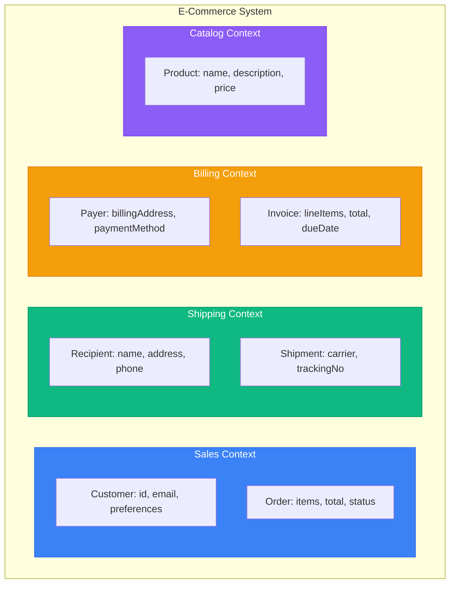
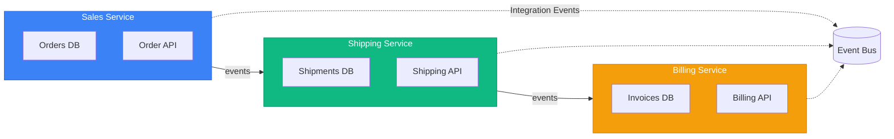
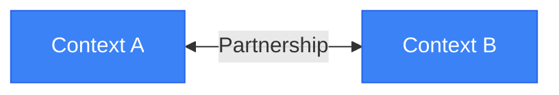
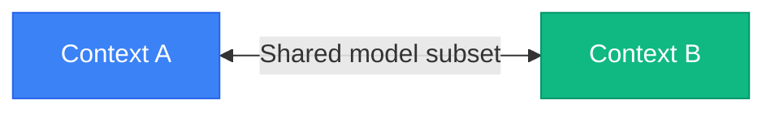
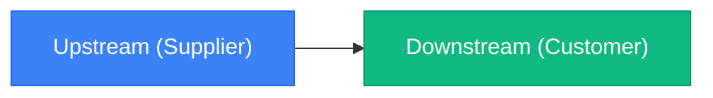
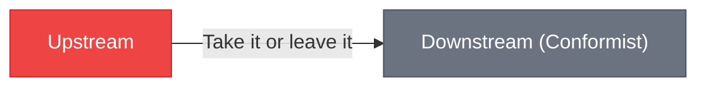
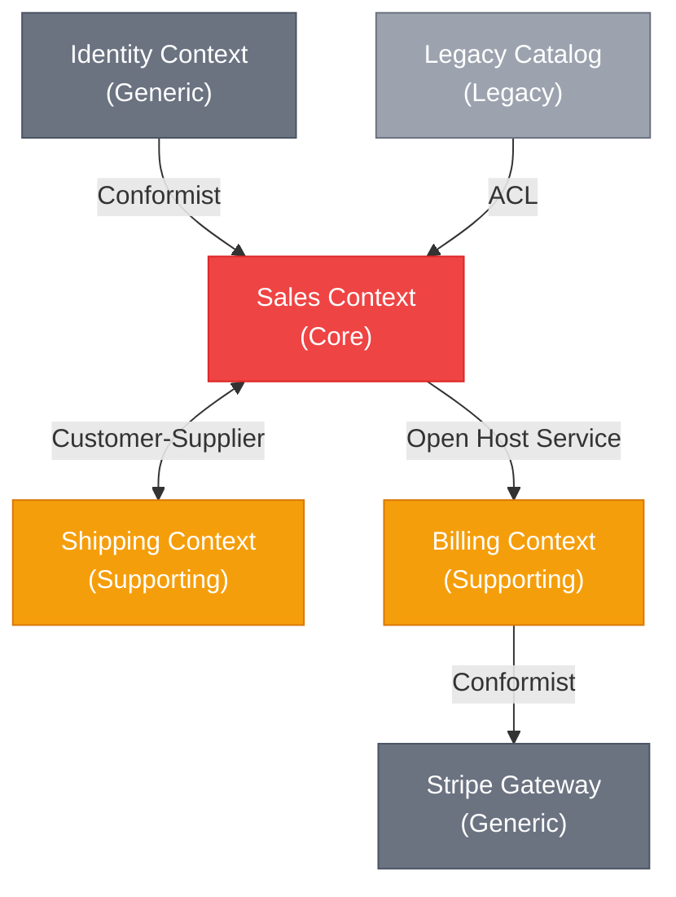

# DDD Strategic Patterns (Go)

> Sources:
> - [Domain-Driven Design: The Blue Book](https://www.domainlanguage.com/ddd/blue-book/) — Eric Evans (2003)
> - [DDD Resources](https://www.domainlanguage.com/ddd/) — Domain Language (Eric Evans)
> - [Bounded Context](https://martinfowler.com/bliki/BoundedContext.html) — Martin Fowler
> - [Domain Driven Design](https://martinfowler.com/bliki/DomainDrivenDesign.html) — Martin Fowler
> - [Anti-Corruption Layer](https://docs.aws.amazon.com/prescriptive-guidance/latest/cloud-design-patterns/acl.html) — AWS
> - [Domain Analysis for Microservices](https://learn.microsoft.com/en-us/azure/architecture/microservices/model/domain-analysis) — Microsoft

## Overview

Los patrones estratégicos de DDD ayudan a dividir dominios grandes en límites claros: **¿cómo partimos el dominio para que evolucione sin colapsar?**

DDD estratégico es colaborativo: surge de workshops con expertos de negocio, no del código aislado.

---

## Domain Discovery Techniques

### Event Storming

```text
Orange sticky: Domain Event (pasado: "OrderPlaced")
Blue sticky: Command (imperativo: "PlaceOrder")
Yellow sticky: Aggregate (sustantivo: "Order")
Pink sticky: External System / Policy
Purple sticky: Problem / Question
```

Flow recomendado:
1. Exploración caótica: volcar eventos conocidos.
2. Orden temporal.
3. Identificar agregados.
4. Detectar fronteras de lenguaje.
5. Marcar incertidumbres.

### Context Mapping Workshop

1. Lista sistemas/servicios actuales.
2. Define ownership por equipo.
3. Dibuja relaciones upstream/downstream.
4. Etiqueta tipo de relación.
5. Identifica puntos de fricción.

---

## Ubiquitous Language

Lenguaje compartido negocio+desarrollo, visible en código, docs, UI y conversaciones.

### Principles

1. Un lenguaje por bounded context.
2. El código refleja lenguaje de negocio.
3. Si cambia el lenguaje, cambia el modelo.

### Example (Go)

```go
// ❌ Técnico, pobre lenguaje ubicuo
func (o *Order) SetStatus(status int) { o.status = status }

// ✅ Lenguaje ubicuo
func (o *Order) Confirm() error {
	if o.status != StatusPending {
		return ErrOrderCannotBeConfirmed
	}
	o.status = StatusConfirmed
	o.confirmedAt = time.Now().UTC()
	o.addEvent(OrderConfirmed{OrderID: o.id})
	return nil
}
```

---

## Bounded Contexts

Límite semántico donde un modelo y su lenguaje son consistentes.

### Example: E-Commerce System



La palabra "Customer" puede significar cosas distintas en Sales, Shipping y Billing. Eso es normal.

### Bounded Context -> Microservice Boundary



---

## Subdomains

Subdominios se descubren, no se inventan.

| Type | Description | Investment | Example |
|------|-------------|------------|---------|
| **Core** | Ventaja competitiva | High | Recomendaciones/precios |
| **Supporting** | Necesario pero no diferenciador | Medium | Gestión de pedidos |
| **Generic** | Commodity | Low | Auth, pagos, email |

Preguntas guía:
1. ¿Qué nos diferencia? -> Core.
2. ¿Qué necesitamos pero no es especialidad? -> Supporting.
3. ¿Qué es estándar de mercado? -> Generic.

---

## Context Mapping

### Relationship Patterns

#### Partnership



#### Shared Kernel



#### Customer-Supplier



#### Conformist



#### Anti-Corruption Layer (ACL)


### ACL Example (Go)

```go
package stripeacl

import (
	"context"
	"strings"
)

type StripeClient interface {
	CreatePaymentIntent(ctx context.Context, in StripePaymentIntentInput) (StripePaymentIntent, error)
}

type PaymentStatus string

const (
	PaymentPending    PaymentStatus = "pending"
	PaymentProcessing PaymentStatus = "processing"
	PaymentCompleted  PaymentStatus = "completed"
	PaymentCancelled  PaymentStatus = "cancelled"
	PaymentUnknown    PaymentStatus = "unknown"
)

type ACL struct{ stripe StripeClient }

func (a ACL) TranslateStatus(stripeStatus string) PaymentStatus {
	switch strings.ToLower(stripeStatus) {
	case "requires_payment_method", "requires_confirmation", "requires_action":
		return PaymentPending
	case "processing":
		return PaymentProcessing
	case "succeeded":
		return PaymentCompleted
	case "canceled":
		return PaymentCancelled
	default:
		return PaymentUnknown
	}
}
```

---

## Integration Patterns

### Domain Events for Context Integration (Go)

```go
package integration

import "context"

type OrderPlaced struct {
	EventType       string
	OrderID         string
	CustomerID      string
	Items           []OrderPlacedItem
	TotalCents      int64
	Currency        string
	ShippingAddress Address
	OccurredAt      string
}

type ShippingOrderPlacedHandler struct {
	shipments ShipmentRepository
}

func (h ShippingOrderPlacedHandler) Handle(ctx context.Context, e OrderPlaced) error {
	shipment := NewShipmentFromOrder(e.OrderID, e.ShippingAddress, e.Items)
	return h.shipments.Save(ctx, shipment)
}

type BillingOrderPlacedHandler struct {
	invoices InvoiceRepository
}

func (h BillingOrderPlacedHandler) Handle(ctx context.Context, e OrderPlaced) error {
	invoice := NewInvoiceFromOrder(e.OrderID, e.CustomerID, e.Items, e.TotalCents, e.Currency)
	return h.invoices.Save(ctx, invoice)
}
```

### Published Language / Event Contract (Go)

```go
package events

type OrderPlacedV1 struct {
	SchemaVersion string            `json:"schemaVersion"`
	EventType     string            `json:"eventType"`
	EventID       string            `json:"eventId"`
	OccurredAt    string            `json:"occurredAt"`
	Payload       OrderPlacedPayload `json:"payload"`
}

type OrderPlacedPayload struct {
	OrderID    string `json:"orderId"`
	CustomerID string `json:"customerId"`
	TotalCents int64  `json:"totalCents"`
	Currency   string `json:"currency"`
}
```

---

## Context Map Diagram



---

## Strategic Design Checklist

- [ ] Alinear lenguaje ubicuo con expertos de dominio.
- [ ] Clasificar subdominios (core/supporting/generic).
- [ ] Definir bounded contexts con límites explícitos.
- [ ] Documentar context map y relación entre contextos.
- [ ] Diseñar ACL para sistemas externos conflictivos.
- [ ] Versionar eventos de integración.
- [ ] Mantener base de datos por contexto.
