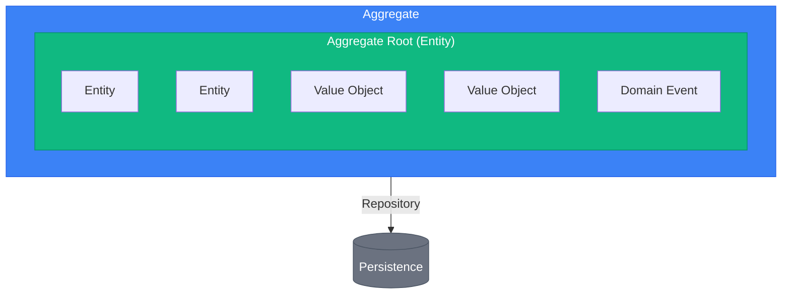

# DDD Tactical Patterns (Go)

> Sources:
> - [Domain-Driven Design: The Blue Book](https://www.domainlanguage.com/ddd/blue-book/) — Eric Evans (2003)
> - [Implementing Domain-Driven Design](https://openlibrary.org/works/OL17392277W) — Vaughn Vernon (2013)
> - [Effective Aggregate Design](https://www.dddcommunity.org/library/vernon_2011/) — Vaughn Vernon
> - [Repository Pattern](https://martinfowler.com/eaaCatalog/repository.html) — Martin Fowler

## Building Blocks Overview



---

## Entity

Objeto con **identidad** estable en el tiempo. La igualdad es por identidad, no por valores.

### Characteristics

- Identificador único
- Ciclo de vida propio
- Estado mutable bajo reglas
- Contiene comportamiento

### Pattern (Go)

```go
package order

type OrderItem struct {
	id        string
	productID string
	quantity  Quantity
	unitPrice Money
}

func NewOrderItem(id, productID string, quantity Quantity, unitPrice Money) (OrderItem, error) {
	if id == "" || productID == "" {
		return OrderItem{}, ErrInvalidID
	}
	return OrderItem{id: id, productID: productID, quantity: quantity, unitPrice: unitPrice}, nil
}

func (i *OrderItem) IncreaseQuantity(delta Quantity) error {
	next, err := i.quantity.Add(delta)
	if err != nil {
		return err
	}
	i.quantity = next
	return nil
}

func (i OrderItem) SameIdentity(other OrderItem) bool {
	return i.id == other.id
}

func (i OrderItem) Subtotal() (Money, error) {
	return i.unitPrice.Multiply(i.quantity.Value())
}
```

---

## Value Object

Objeto definido por atributos, sin identidad, inmutable y validado al crearse.

### Common Value Objects

| Value Object | Attributes | Validation |
|--------------|------------|------------|
| Money | amount, currency | amount >= 0 |
| Email | address | formato válido |
| Address | street, city, zip, country | campos requeridos |
| DateRange | start, end | start <= end |
| Quantity | value | value > 0 |

### Pattern (Go)

```go
package shared

import (
	"fmt"
	"net/mail"
	"strings"
)

type Money struct {
	amount   int64 // cents
	currency string
}

func NewMoney(amount int64, currency string) (Money, error) {
	if amount < 0 {
		return Money{}, ErrInvalidMoney
	}
	currency = strings.ToUpper(strings.TrimSpace(currency))
	if currency == "" {
		return Money{}, ErrInvalidCurrency
	}
	return Money{amount: amount, currency: currency}, nil
}

func (m Money) Add(other Money) (Money, error) {
	if m.currency != other.currency {
		return Money{}, ErrCurrencyMismatch
	}
	return Money{amount: m.amount + other.amount, currency: m.currency}, nil
}

func (m Money) Equals(other Money) bool {
	return m.amount == other.amount && m.currency == other.currency
}

type Email struct{ value string }

func NewEmail(raw string) (Email, error) {
	normalized := strings.ToLower(strings.TrimSpace(raw))
	if _, err := mail.ParseAddress(normalized); err != nil {
		return Email{}, fmt.Errorf("email: %w", err)
	}
	return Email{value: normalized}, nil
}
```

---

## Aggregate

Clúster de entidades/VOs tratado como unidad de consistencia. Tiene una frontera transaccional clara.

### Rules

1. Un único aggregate root.
2. Referencias externas por ID.
3. Una transacción por agregado.
4. Invariantes dentro del límite.
5. Preferir agregados pequeños.

### Aggregate Sizing Heuristics

| Metric | Healthy | Warning | Action |
|--------|---------|---------|--------|
| Entities per aggregate | 1-5 | 6-10 | >10: split |
| LOC in root | <500 | 500-1000 | >1000: split |
| Lock time | <100ms | 100-500ms | >500ms: split |
| Conflict rate | Rare | Occasional | Frequent: split |

### Pattern (Go)

```go
package order

import "time"

type AggregateRoot struct {
	version int
	events  []Event
}

func (a *AggregateRoot) addEvent(e Event) { a.events = append(a.events, e) }
func (a *AggregateRoot) PullEvents() []Event {
	out := a.events
	a.events = nil
	return out
}

type Order struct {
	AggregateRoot
	id              string
	customerID      string
	items           []OrderItem
	status          Status
	shippingAddress *Address
	createdAt       time.Time
}

func NewOrder(id, customerID string) *Order {
	o := &Order{id: id, customerID: customerID, status: StatusDraft, createdAt: time.Now().UTC()}
	o.addEvent(OrderCreated{OrderID: id, CustomerID: customerID})
	return o
}

func (o *Order) AddItem(productID string, quantity Quantity, unitPrice Money) error {
	if o.status == StatusCancelled || o.status == StatusShipped {
		return ErrInvalidOrderState
	}
	item, err := NewOrderItem(newOrderItemID(), productID, quantity, unitPrice)
	if err != nil {
		return err
	}
	o.items = append(o.items, item)
	o.addEvent(OrderItemAdded{OrderID: o.id, ProductID: productID, Quantity: quantity.Value()})
	return nil
}

func (o *Order) Confirm() error {
	if o.status != StatusDraft {
		return ErrInvalidOrderState
	}
	if len(o.items) == 0 {
		return ErrEmptyOrder
	}
	if o.shippingAddress == nil {
		return ErrMissingShippingAddress
	}
	o.status = StatusConfirmed
	o.addEvent(OrderConfirmed{OrderID: o.id})
	return nil
}
```

---

## Repository

Abstrae persistencia de agregados.

### Rules

1. Un repository por agregado.
2. Interface en dominio, implementación en infraestructura.
3. Cargar/guardar agregado completo.
4. Queries complejas en read model separado.

### Pattern (Go)

```go
package order

import "context"

type Repository interface {
	FindByID(ctx context.Context, id string) (*Order, error)
	FindByCustomerID(ctx context.Context, customerID string) ([]*Order, error)
	Save(ctx context.Context, order *Order) error
	Delete(ctx context.Context, order *Order) error
	NextID() string
}
```

### Common Mistakes

**Wrong: repository por entidad hija**

```go
package order

type OrderItemRepository interface {
	FindByOrderID(orderID string) ([]OrderItem, error)
	Save(item OrderItem) error
}
```

**Wrong: queries analíticas mezcladas**

```go
package order

type Repository interface {
	FindByStatus(status Status) ([]*Order, error)
	CountByCustomer(customerID string) (int, error)
}
```

**Correct: repo de agregado + read model**

```go
package order

type Repository interface {
	FindByID(ctx context.Context, id string) (*Order, error)
	Save(ctx context.Context, order *Order) error
}

type ReadModel interface {
	FindByStatus(ctx context.Context, status string) ([]OrderSummaryDTO, error)
	CountByCustomer(ctx context.Context, customerID string) (int, error)
}
```

---

## Domain Event

Hecho relevante que ocurrió en el dominio.

### Characteristics

- Inmutable
- Nombre en pasado (`OrderCreated`)
- Payload útil para consumidores
- Timestamp de ocurrencia

### Pattern (Go)

```go
package order

import "time"

type Event interface {
	EventID() string
	EventType() string
	OccurredAt() time.Time
}

type BaseEvent struct {
	ID   string
	When time.Time
}

func (e BaseEvent) EventID() string      { return e.ID }
func (e BaseEvent) OccurredAt() time.Time { return e.When }

type OrderCreated struct {
	BaseEvent
	OrderID    string
	CustomerID string
}

func (OrderCreated) EventType() string { return "order.created" }

type OrderConfirmed struct {
	BaseEvent
	OrderID string
	Total   Money
}

func (OrderConfirmed) EventType() string { return "order.confirmed" }
```

---

## Domain Service

Lógica de negocio sin estado que no encaja naturalmente en una entidad.

### When to Use

- Opera sobre múltiples agregados
- Requiere políticas de negocio transversales
- No tiene estado interno relevante

### Pattern (Go)

```go
package pricing

type DiscountPolicy interface {
	Calculate(order Order, customer Customer) (Money, error)
}

type DefaultDiscountPolicy struct{}

func (DefaultDiscountPolicy) Calculate(order Order, customer Customer) (Money, error) {
	discount := ZeroMoney("USD")
	if order.ItemCount() > 10 {
		d, _ := order.Total().MultiplyPercent(5)
		discount, _ = discount.Add(d)
	}
	if customer.IsVIP() {
		d, _ := order.Total().MultiplyPercent(10)
		discount, _ = discount.Add(d)
	}
	max, _ := order.Total().MultiplyPercent(20)
	return discount.Min(max), nil
}
```

---

## Factory

Encapsula creación compleja de agregados.

```go
package order

type Factory interface {
	FromCart(cart Cart, customer Customer) (*Order, error)
}

type DefaultFactory struct{}

func (DefaultFactory) FromCart(cart Cart, customer Customer) (*Order, error) {
	if cart.IsEmpty() {
		return nil, ErrEmptyCart
	}
	o := NewOrder(newOrderID(), customer.ID())
	for _, ci := range cart.Items() {
		if err := o.AddItem(ci.ProductID, NewQuantity(ci.Quantity), ci.UnitPrice); err != nil {
			return nil, err
		}
	}
	if customer.DefaultAddress() != nil {
		o.SetShippingAddress(*customer.DefaultAddress())
	}
	return o, nil
}
```

---

## Specification Pattern

Encapsula reglas de validación o filtrado composables.

```go
package spec

type Specification[T any] interface {
	IsSatisfiedBy(candidate T) bool
}

type And[T any] struct {
	A Specification[T]
	B Specification[T]
}

func (s And[T]) IsSatisfiedBy(c T) bool {
	return s.A.IsSatisfiedBy(c) && s.B.IsSatisfiedBy(c)
}

type OrderOverValue struct{ MinCents int64 }

func (s OrderOverValue) IsSatisfiedBy(o Order) bool {
	return o.Total().Amount() >= s.MinCents
}

type OrderHasItems struct{}

func (OrderHasItems) IsSatisfiedBy(o Order) bool {
	return o.ItemCount() > 0
}
```
