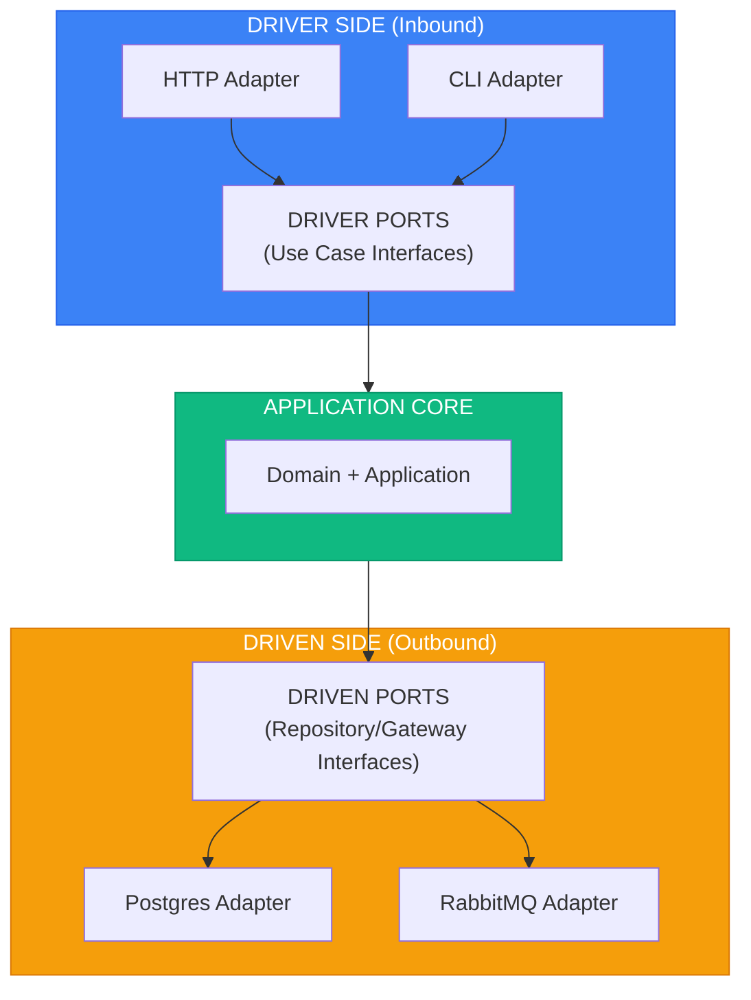
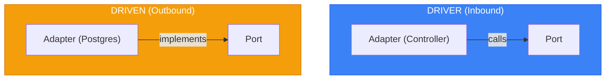

# Hexagonal Architecture (Ports & Adapters) in Go

> Sources:
> - [Hexagonal Architecture](https://alistair.cockburn.us/hexagonal-architecture/) — Alistair Cockburn (2005)
> - [Hexagonal Architecture Explained](https://openlibrary.org/works/OL38388131W) — Alistair Cockburn & Juan Manuel Garrido de Paz (2024)
> - [Interview with Alistair Cockburn](https://jmgarridopaz.github.io/content/interviewalistair.html) — Juan Manuel Garrido de Paz
> - [Hexagonal Architecture Pattern](https://docs.aws.amazon.com/prescriptive-guidance/latest/cloud-design-patterns/hexagonal-architecture.html) — AWS
> - [sarulabs/di README](https://github.com/sarulabs/di) — API and usage examples
> - [pkg.go.dev github.com/sarulabs/di/v2](https://pkg.go.dev/github.com/sarulabs/di/v2) — Definitions, scopes, container lifecycle

## Core Concept

> "Allow an application to equally be driven by users, programs, automated tests, or batch scripts, and to be developed and tested in isolation from its eventual run-time devices and databases."

Si puedes correr el core de negocio desde tests (sin GUI, sin DB real), tus límites hexagonales están bien.



---

## Ports

Interfaces que definen cómo el core conversa con el exterior.

### Driver Ports (Inbound)

Definen cómo el exterior usa la aplicación.

```go
package ports

import "context"

type PlaceOrderUseCase interface {
	Execute(ctx context.Context, cmd PlaceOrderCommand) (string, error)
}

type GetOrderUseCase interface {
	Execute(ctx context.Context, q GetOrderQuery) (*OrderDTO, error)
}

type CancelOrderUseCase interface {
	Execute(ctx context.Context, cmd CancelOrderCommand) error
}
```

### Driven Ports (Outbound)

Definen dependencias externas que el core necesita.

```go
package ports

import "context"

type OrderRepository interface {
	FindByID(ctx context.Context, id string) (*Order, error)
	Save(ctx context.Context, order *Order) error
	Delete(ctx context.Context, order *Order) error
}

type EventPublisher interface {
	Publish(ctx context.Context, e Event) error
	PublishAll(ctx context.Context, events []Event) error
}

type PaymentGateway interface {
	Charge(ctx context.Context, amount Money, method PaymentMethod) (PaymentResult, error)
	Refund(ctx context.Context, paymentID string, amount Money) (RefundResult, error)
}

type NotificationService interface {
	SendEmail(ctx context.Context, to Email, tpl EmailTemplate) error
	SendSMS(ctx context.Context, to PhoneNumber, message string) error
}
```

---

## Adapters

Implementaciones concretas que conectan puertos con tecnologías.

### Driver Adapters (Inbound)

```go
package rest

import (
	"encoding/json"
	"net/http"
)

type OrderHandler struct {
	place ports.PlaceOrderUseCase
	get   ports.GetOrderUseCase
}

func (h OrderHandler) Create(w http.ResponseWriter, r *http.Request) {
	var req PlaceOrderRequest
	if err := json.NewDecoder(r.Body).Decode(&req); err != nil {
		http.Error(w, "invalid request", http.StatusBadRequest)
		return
	}
	id, err := h.place.Execute(r.Context(), toCommand(req))
	if err != nil {
		writeError(w, err)
		return
	}
	writeJSON(w, http.StatusCreated, map[string]string{"id": id})
}

func (h OrderHandler) Show(w http.ResponseWriter, r *http.Request) {
	id := pathValue(r, "id")
	order, err := h.get.Execute(r.Context(), ports.GetOrderQuery{OrderID: id})
	if err != nil {
		writeError(w, err)
		return
	}
	if order == nil {
		http.NotFound(w, r)
		return
	}
	writeJSON(w, http.StatusOK, order)
}
```

CLI and message adapters call the same driver ports:

```go
package cli

func PlaceOrderCommand(useCase ports.PlaceOrderUseCase, args Args) error {
	_, err := useCase.Execute(context.Background(), ports.PlaceOrderCommand{
		CustomerID: args.CustomerID,
		Items:      args.Items,
	})
	return err
}
```

### Driven Adapters (Outbound)

**Postgres repository:**

```go
package postgres

func (r OrderRepository) Save(ctx context.Context, o *domain.Order) error {
	_, err := r.db.ExecContext(ctx,
		`INSERT INTO orders(id, customer_id, status) VALUES($1,$2,$3)
		 ON CONFLICT (id) DO UPDATE SET status=$3`,
		o.ID(), o.CustomerID(), o.Status(),
	)
	return err
}
```

**In-memory repository (tests):**

```go
package inmem

type OrderRepository struct {
	mu     sync.RWMutex
	orders map[string]*domain.Order
}

func (r *OrderRepository) FindByID(_ context.Context, id string) (*domain.Order, error) {
	r.mu.RLock()
	defer r.mu.RUnlock()
	return r.orders[id], nil
}

func (r *OrderRepository) Save(_ context.Context, o *domain.Order) error {
	r.mu.Lock()
	defer r.mu.Unlock()
	r.orders[o.ID()] = o
	return nil
}
```

**Event publisher:**

```go
package rabbitmq

func (p Publisher) Publish(ctx context.Context, e domain.Event) error {
	body, err := json.Marshal(eventEnvelopeFromDomain(e))
	if err != nil {
		return err
	}
	return p.channel.PublishWithContext(ctx, "domain_events", e.EventType(), false, false, amqp.Publishing{
		ContentType: "application/json",
		Body:        body,
	})
}
```

---

## Naming Conventions

### Cockburn style

**Ports:** `For[Doing][Something]`
- `ForPlacingOrders`
- `ForStoringOrders`

**Adapters:** tecnología + propósito
- `HTTPHandlerForPlacingOrders`
- `PostgresRepositoryForStoringOrders`

### Go-friendly alternative

| Pattern | Port | Adapter |
|---------|------|---------|
| Use case name | `PlaceOrderUseCase` | `HTTPOrderHandler` |
| Resource name | `OrderRepository` | `PostgresOrderRepository` |
| Integration name | `PaymentGateway` | `StripePaymentGateway` |

---

## Project Structure (Go)

```text
internal/
├── application/
│   ├── ports/
│   │   ├── driver/
│   │   └── driven/
│   └── usecases/
├── infrastructure/
│   └── adapters/
│       ├── driver/
│       │   ├── rest/
│       │   ├── grpc/
│       │   └── cli/
│       └── driven/
│           ├── postgres/
│           ├── rabbitmq/
│           ├── stripe/
│           └── inmem/
└── domain/
```

---

## Key Asymmetry



- Inbound: el adaptador llama al puerto.
- Outbound: el adaptador implementa el puerto.

---

## Configurability via Adapters (Go)

```go
package config

func NewDependencies(env string) Dependencies {
	switch env {
	case "test":
		return Dependencies{
			OrderRepo: inmem.NewOrderRepository(),
			Publisher: spy.NewEventPublisher(),
			Payments:  mock.NewPaymentGateway(),
		}
	case "dev":
		return Dependencies{
			OrderRepo: inmem.NewOrderRepository(),
			Publisher: inmem.NewEventPublisher(),
			Payments:  fake.NewPaymentGateway(),
		}
	default:
		return Dependencies{
			OrderRepo: postgres.NewOrderRepository(mustOpenDB()),
			Publisher: rabbitmq.NewPublisher(mustOpenAMQP()),
			Payments:  stripe.NewGateway(mustStripeClient()),
		}
	}
}
```

---

## Dependency Injection with `sarulabs/di` (concise)

### Where to place the container code

```text
internal/infrastructure/di/
├── builder.go          # NewBuilder + Build
└── modules/
    ├── domain.go       # servicios de dominio (si aplica)
    ├── application.go  # use cases
    ├── infrastructure.go # repos/gateways concretos
    └── http.go         # handlers/controllers
```

Regla práctica:
- `cmd/api/main.go` crea `builder`, registra módulos, construye contenedor y hace `defer ctn.Delete()`.
- Los handlers/adapters reciben dependencias ya resueltas (o una factory), no el container completo como service locator global.

### Registration flow

```go
package di

import "github.com/sarulabs/di/v2"

func BuildContainer() (di.Container, error) {
	b, err := di.NewBuilder()
	if err != nil {
		return nil, err
	}
	for _, fn := range []func(*di.Builder) error{
		RegisterInfrastructure,
		RegisterApplication,
		RegisterHTTP,
	} {
		if err := fn(b); err != nil {
			return nil, err
		}
	}
	return b.Build(), nil
}
```

```go
package di

func RegisterApplication(b *di.Builder) error {
	return b.Add(di.Def{
		Name:  "place-order-usecase",
		Scope: di.App,
		Build: func(ctn di.Container) (any, error) {
			return placeorder.NewHandler(
				ctn.Get("order-repository").(ports.OrderRepository),
				ctn.Get("product-repository").(ports.ProductRepository),
				ctn.Get("event-publisher").(ports.EventPublisher),
			), nil
		},
	})
}
```

### Scopes and lifecycle

- Usa `di.App` para singletons de proceso (DB pool, broker client, repos stateless).
- Usa `di.Request` para objetos por request (request context wrappers, unit of work por request).
- Usa `app.SubContainer()` para crear container de request y **siempre** `defer requestCtn.Delete()`.
- Si una definición crea recursos, añade `Close` en `di.Def` para cleanup explícito.

```go
func HTTPMiddleware(next http.Handler, appCtn di.Container) http.Handler {
	return http.HandlerFunc(func(w http.ResponseWriter, r *http.Request) {
		requestCtn, err := appCtn.SubContainer()
		if err != nil {
			http.Error(w, "container error", http.StatusInternalServerError)
			return
		}
		defer requestCtn.Delete()
		next.ServeHTTP(w, r.WithContext(context.WithValue(r.Context(), containerKey{}, requestCtn)))
	})
}
```

### Testing

- En tests, registra módulo alternativo (`RegisterTestOverrides`) con fakes/spies.
- Construye contenedor por test suite y elimina con `Delete`.
- Mantén nombres de `di.Def` estables y explícitos (`order-repository`, `place-order-usecase`) para evitar ambigüedad.

---

## Strong vs Weak Hexagonal

### Weak

```go
// ❌ filtra detalles tecnológicos

type OrderRepository interface {
	FindByQuery(ctx context.Context, sql string, args ...any) ([]Order, error)
}
```

### Strong

```go
// ✅ semántica de dominio

type OrderRepository interface {
	FindByID(ctx context.Context, id string) (*Order, error)
	FindByCustomer(ctx context.Context, customerID string) ([]*Order, error)
	Save(ctx context.Context, order *Order) error
}
```

---

## Benefits

1. Testabilidad real del core.
2. Flexibilidad tecnológica.
3. Evolución independiente por capas.
4. Límites explícitos y revisables.
5. Desarrollo paralelo de adaptadores.
