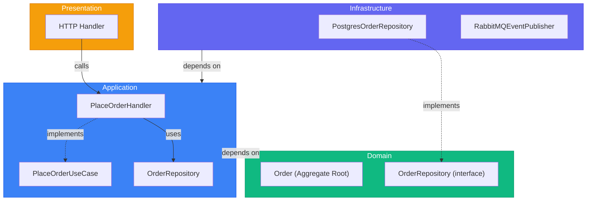

# Layer Structure - Complete Reference (Go)

> Sources:
> - [The Clean Architecture](https://blog.cleancoder.com/uncle-bob/2012/08/13/the-clean-architecture.html) — Robert C. Martin
> - [Designing a DDD-oriented Microservice](https://learn.microsoft.com/en-us/dotnet/architecture/microservices/microservice-ddd-cqrs-patterns/ddd-oriented-microservice) — Microsoft
> - [Clean Architecture: Standing on the Shoulders of Giants](https://herbertograca.com/2017/09/28/clean-architecture-standing-on-the-shoulders-of-giants/) — Herberto Graça

## The Four Layers

| Layer | Responsibility | Dependencies |
|-------|---------------|--------------|
| **Domain** | Business logic, entities, invariants | None |
| **Application** | Use cases and orchestration | Domain |
| **Infrastructure** | DB, broker, external APIs, frameworks | Application, Domain |
| **Presentation** | HTTP/gRPC/CLI entry points | Application |

---

## Domain Layer (Innermost)

Núcleo del sistema. Contiene reglas de negocio sin dependencia externa.

### Contents

```text
internal/domain/
├── order/
│   ├── order.go               # Aggregate root
│   ├── order_item.go          # Child entity
│   ├── value_objects.go       # Money, Address, Status
│   ├── events.go              # OrderPlaced, OrderShipped
│   ├── repository.go          # OrderRepository interface
│   ├── services.go            # PricingService
│   └── errors.go
└── shared/
    ├── event.go
    └── errors.go
```

### Rules

1. No imports de frameworks (gin, echo, gorm, sqlx, kafka client, etc.)
2. No detalles de persistencia o transporte
3. Lógica de negocio explícita
4. Entidades ricas, no solo getters/setters

### Example: Domain Aggregate (Go)

```go
package order

import "time"

type Status string

const (
	StatusDraft     Status = "draft"
	StatusConfirmed Status = "confirmed"
	StatusShipped   Status = "shipped"
)

type Order struct {
	id         string
	customerID string
	items      []OrderItem
	status     Status
	events     []Event
	createdAt  time.Time
}

func New(id, customerID string) *Order {
	o := &Order{
		id:         id,
		customerID: customerID,
		status:     StatusDraft,
		createdAt:  time.Now().UTC(),
	}
	o.addEvent(OrderPlaced{OrderID: id, CustomerID: customerID})
	return o
}

func (o *Order) AddItem(productID string, quantity int, price Money) error {
	if quantity <= 0 {
		return ErrInvalidQuantity
	}
	if o.status != StatusDraft {
		return ErrInvalidOrderState
	}
	o.items = append(o.items, NewOrderItem(productID, quantity, price))
	return nil
}

func (o *Order) Ship() error {
	if o.status != StatusConfirmed {
		return ErrInvalidOrderState
	}
	o.status = StatusShipped
	o.addEvent(OrderShipped{OrderID: o.id})
	return nil
}

func (o *Order) Total() (Money, error) {
	total := ZeroMoney("USD")
	for _, it := range o.items {
		next, err := total.Add(it.Subtotal())
		if err != nil {
			return Money{}, err
		}
		total = next
	}
	return total, nil
}
```

---

## Application Layer

Orquesta casos de uso coordinando dominio y puertos externos.

### Contents

```text
internal/application/
├── orders/
│   ├── place_order/
│   │   ├── command.go
│   │   ├── handler.go
│   │   └── port.go
│   ├── ship_order/
│   │   └── handler.go
│   └── get_order/
│       ├── query.go
│       ├── handler.go
│       └── result.go
└── shared/
    ├── unit_of_work.go
    ├── event_publisher.go
    └── errors.go
```

### Rules

1. Depende solo de dominio (no implementaciones infra)
2. Define puertos (repos, gateways, publisher)
3. Orquesta flujos, no implementa reglas de negocio profundas
4. Gestiona límites de transacción

### Example: Use Case Handler (Go)

```go
package placeorder

import (
	"context"
	"fmt"
)

type Handler struct {
	orders    OrderRepository
	products  ProductRepository
	uow       UnitOfWork
	publisher EventPublisher
}

func (h Handler) Execute(ctx context.Context, cmd Command) (string, error) {
	if err := h.uow.Begin(ctx); err != nil {
		return "", fmt.Errorf("begin tx: %w", err)
	}
	defer h.uow.Rollback(ctx)

	order := NewOrder(newOrderID(), cmd.CustomerID)
	for _, item := range cmd.Items {
		product, err := h.products.FindByID(ctx, item.ProductID)
		if err != nil {
			return "", err
		}
		if err := order.AddItem(product.ID, item.Quantity, product.Price); err != nil {
			return "", err
		}
	}

	if err := h.orders.Save(ctx, order); err != nil {
		return "", err
	}
	if err := h.uow.Commit(ctx); err != nil {
		return "", err
	}
	if err := h.publisher.PublishAll(ctx, order.PullEvents()); err != nil {
		return "", err
	}
	return order.ID(), nil
}
```

### Command/Query DTOs (Go)

```go
package dto

type PlaceOrderCommand struct {
	CustomerID string
	Items      []PlaceOrderItem
}

type PlaceOrderItem struct {
	ProductID string
	Quantity  int
}

type GetOrderQuery struct {
	OrderID string
}

type OrderDTO struct {
	ID         string
	CustomerID string
	Status     string
	Items      []OrderItemDTO
	TotalCents int64
	Currency   string
	CreatedAt  string
}
```

---

## Infrastructure Layer

Implementa puertos definidos por dominio/aplicación con tecnologías concretas.

### Contents

```text
internal/infrastructure/
├── persistence/
│   ├── postgres/
│   │   ├── order_repository.go
│   │   ├── product_repository.go
│   │   ├── unit_of_work.go
│   │   └── mappers/
│   └── inmem/
│       ├── order_repository.go
│       └── unit_of_work.go
├── messaging/
│   ├── rabbitmq/
│   │   └── event_publisher.go
│   └── inmem/
│       └── event_publisher.go
├── external/
│   ├── payment/
│   │   └── stripe_gateway.go
│   └── shipping/
│       └── fedex_client.go
└── http/
    ├── rest/
    │   ├── order_handler.go
    │   └── routes.go
    └── middleware/
```

### Rules

1. Implementa interfaces de puertos
2. Contiene código de framework/drivers
3. Hace mapping Domain <-> Persistence/Transport
4. Permite cambiar tecnología sin tocar el core

### Example: Repository Implementation (Go)

```go
package postgres

import (
	"context"
	"database/sql"
)

type OrderRepository struct{ db *sql.DB }

func (r OrderRepository) FindByID(ctx context.Context, id string) (*order.Order, error) {
	row := r.db.QueryRowContext(ctx, `SELECT id, customer_id, status FROM orders WHERE id = $1`, id)
	var rec orderRecord
	if err := row.Scan(&rec.ID, &rec.CustomerID, &rec.Status); err != nil {
		if err == sql.ErrNoRows {
			return nil, nil
		}
		return nil, err
	}
	return toDomain(rec), nil
}

func (r OrderRepository) Save(ctx context.Context, o *order.Order) error {
	_, err := r.db.ExecContext(ctx,
		`INSERT INTO orders(id, customer_id, status) VALUES($1,$2,$3)
		 ON CONFLICT(id) DO UPDATE SET status = EXCLUDED.status`,
		o.ID(), o.CustomerID(), o.Status(),
	)
	return err
}
```

---

## Presentation Layer

Entrada del sistema: traduce requests externos a comandos/queries de aplicación.

### Contents

```text
internal/presentation/
├── rest/
│   ├── order_handler.go
│   ├── middleware/
│   │   ├── auth.go
│   │   ├── recover.go
│   │   └── validation.go
│   ├── dto/
│   │   ├── requests.go
│   │   └── responses.go
│   └── routes.go
├── grpc/
│   └── order_server.go
└── cli/
    └── commands.go
```

### Example: HTTP Handler (Go)

```go
package rest

import (
	"encoding/json"
	"net/http"
)

type OrderHandler struct {
	place PlaceOrderUseCase
	get   GetOrderUseCase
}

func (h OrderHandler) Create(w http.ResponseWriter, r *http.Request) {
	var req PlaceOrderRequest
	if err := json.NewDecoder(r.Body).Decode(&req); err != nil {
		http.Error(w, "invalid body", http.StatusBadRequest)
		return
	}

	id, err := h.place.Execute(r.Context(), toCommand(req))
	if err != nil {
		writeAppError(w, err)
		return
	}
	writeJSON(w, http.StatusCreated, map[string]string{"id": id})
}
```

---

## Dependency Flow



---

## Composition Root (Go)

Todo se cablea en el entrypoint.

```go
package main

func main() {
	db := mustOpenDB()
	broker := mustOpenBroker()

	orderRepo := postgres.NewOrderRepository(db)
	productRepo := postgres.NewProductRepository(db)
	uow := postgres.NewUnitOfWork(db)
	publisher := rabbitmq.NewEventPublisher(broker)

	placeOrder := placeorder.NewHandler(orderRepo, productRepo, uow, publisher)
	getOrder := getorder.NewHandler(postgres.NewOrderReadModel(db))

	h := rest.NewOrderHandler(placeOrder, getOrder)
	server := rest.NewServer(h)
	must(server.ListenAndServe())
}
```

La estructura por capas es la misma en cualquier proyecto Go; lo esencial es respetar la dirección de dependencias.
