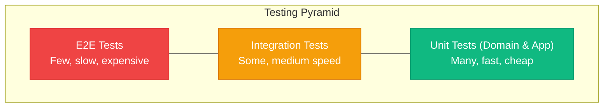

# Testing Patterns (Go)

> Sources:
> - [The Clean Architecture](https://blog.cleancoder.com/uncle-bob/2012/08/13/the-clean-architecture.html) — Robert C. Martin
> - [Hexagonal Architecture](https://alistair.cockburn.us/hexagonal-architecture/) — Alistair Cockburn
> - [Unit Testing](https://martinfowler.com/bliki/UnitTest.html) — Martin Fowler
> - [Test Pyramid](https://martinfowler.com/bliki/TestPyramid.html) — Martin Fowler

Testing strategy for Clean Architecture + DDD + Hexagonal in Go.

## Testing Pyramid



---

## Unit Tests

### Domain Layer Tests

Dominio debe testearse sin mocks ni infraestructura.

```go
package order_test

import (
	"testing"

	"github.com/stretchr/testify/require"
)

func TestOrderAddItem(t *testing.T) {
	tests := []struct {
		name    string
		setup   func() *Order
		wantErr error
	}{
		{
			name: "adds item to draft order",
			setup: func() *Order {
				return NewOrder("ord-1", "cust-1")
			},
		},
		{
			name: "fails for cancelled order",
			setup: func() *Order {
				o := NewOrder("ord-2", "cust-1")
				_ = o.Cancel("test")
				return o
			},
			wantErr: ErrInvalidOrderState,
		},
	}

	for _, tc := range tests {
		t.Run(tc.name, func(t *testing.T) {
			o := tc.setup()
			err := o.AddItem("prod-1", NewQuantity(2), MustMoney(1000, "USD"))
			if tc.wantErr != nil {
				require.ErrorIs(t, err, tc.wantErr)
				return
			}
			require.NoError(t, err)
			require.Len(t, o.Items(), 1)
		})
	}
}

func TestOrderConfirmEmitsEvent(t *testing.T) {
	o := NewOrder("ord-1", "cust-1")
	require.NoError(t, o.AddItem("prod-1", NewQuantity(1), MustMoney(1000, "USD")))
	o.SetShippingAddress(MustAddress("Street", "City", "28001", "ES"))

	require.NoError(t, o.Confirm())
	events := o.PullEvents()
	require.NotEmpty(t, events)
}
```

### Value Object Tests

```go
package shared_test

import (
	"testing"

	"github.com/stretchr/testify/require"
)

func TestMoneyAdd(t *testing.T) {
	a := MustMoney(1000, "USD")
	b := MustMoney(2000, "USD")

	got, err := a.Add(b)
	require.NoError(t, err)
	require.Equal(t, int64(3000), got.Amount())
}

func TestMoneyAddDifferentCurrency(t *testing.T) {
	usd := MustMoney(1000, "USD")
	eur := MustMoney(1000, "EUR")

	_, err := usd.Add(eur)
	require.ErrorIs(t, err, ErrCurrencyMismatch)
}
```

### Application Layer Tests

Casos de uso con mocks/fakes de puertos driven.

```go
package placeorder_test

import (
	"context"
	"testing"

	"github.com/stretchr/testify/require"
)

func TestPlaceOrderHandler_Execute(t *testing.T) {
	orderRepo := &FakeOrderRepo{}
	productRepo := &FakeProductRepo{products: map[string]Product{"prod-1": NewProduct("prod-1", MustMoney(1000, "USD"))}}
	publisher := &SpyPublisher{}
	uow := &FakeUoW{}

	h := NewHandler(orderRepo, productRepo, uow, publisher)
	id, err := h.Execute(context.Background(), Command{
		CustomerID: "cust-1",
		Items:      []Item{{ProductID: "prod-1", Quantity: 2}},
	})

	require.NoError(t, err)
	require.NotEmpty(t, id)
	require.Len(t, orderRepo.saved, 1)
	require.NotEmpty(t, publisher.events)
}
```

---

## Integration Tests

Adaptadores probados con infraestructura real.

```go
package postgres_test

import (
	"context"
	"testing"

	"github.com/stretchr/testify/require"
)

func TestOrderRepository_SaveAndFindByID(t *testing.T) {
	db := mustOpenTestDB(t)
	repo := NewOrderRepository(db)
	ctx := context.Background()

	o := domain.NewOrder("ord-1", "cust-1")
	require.NoError(t, repo.Save(ctx, o))

	got, err := repo.FindByID(ctx, "ord-1")
	require.NoError(t, err)
	require.NotNil(t, got)
	require.Equal(t, "ord-1", got.ID())
}
```

### API Integration Tests

```go
package api_test

import (
	"bytes"
	"net/http"
	"net/http/httptest"
	"testing"

	"github.com/stretchr/testify/require"
)

func TestPOSTOrders(t *testing.T) {
	app := newTestServer(t)
	body := []byte(`{"customer_id":"cust-1","items":[{"product_id":"prod-1","quantity":2}]}`)

	req := httptest.NewRequest(http.MethodPost, "/orders", bytes.NewReader(body))
	rec := httptest.NewRecorder()

	app.ServeHTTP(rec, req)

	require.Equal(t, http.StatusCreated, rec.Code)
}
```

---

## Architecture Tests

Verifican reglas de dependencia arquitectónica.

```go
package architecture_test

import (
	"os/exec"
	"strings"
	"testing"

	"github.com/stretchr/testify/require"
)

func TestDomainDoesNotImportInfrastructure(t *testing.T) {
	// Ejemplo simple: inspección de imports usando go list.
	out, err := exec.Command("go", "list", "-deps", "./internal/domain/...").CombinedOutput()
	require.NoError(t, err)
	text := string(out)
	require.False(t, strings.Contains(text, "internal/infrastructure"))
}
```

---

## Test Organization

```text
tests/
├── unit/
│   ├── domain/
│   │   ├── order_test.go
│   │   └── money_test.go
│   └── application/
│       └── place_order_handler_test.go
├── integration/
│   ├── persistence/
│   │   └── postgres_order_repository_test.go
│   ├── messaging/
│   │   └── rabbitmq_publisher_test.go
│   └── http/
│       └── orders_api_test.go
├── e2e/
│   └── order_workflow_test.go
├── architecture/
│   └── dependency_rules_test.go
├── fixtures/
│   ├── orders.go
│   └── products.go
└── helpers/
    ├── test_db.go
    └── test_fakes.go
```

---

## Test Fixtures & Builders

```go
package fixtures

type OrderBuilder struct {
	customerID string
	items      []Item
	confirmed  bool
}

func NewOrderBuilder() *OrderBuilder {
	return &OrderBuilder{customerID: "default-customer"}
}

func (b *OrderBuilder) WithCustomer(id string) *OrderBuilder {
	b.customerID = id
	return b
}

func (b *OrderBuilder) WithItem(productID string, qty int, cents int64) *OrderBuilder {
	b.items = append(b.items, Item{ProductID: productID, Quantity: qty, UnitPrice: MustMoney(cents, "USD")})
	return b
}

func (b *OrderBuilder) Confirmed() *OrderBuilder {
	b.confirmed = true
	return b
}

func (b *OrderBuilder) Build() *domain.Order {
	o := domain.NewOrder("ord-fixture", b.customerID)
	for _, it := range b.items {
		_ = o.AddItem(it.ProductID, domain.NewQuantity(it.Quantity), it.UnitPrice)
	}
	if b.confirmed {
		o.SetShippingAddress(MustAddress("Street", "City", "28001", "ES"))
		_ = o.Confirm()
	}
	o.PullEvents() // limpiar ruido de construcción
	return o
}
```

---

## Key Testing Principles

1. Testear comportamiento, no implementación interna.
2. Dominio sin mocks (es puro).
3. Mockear/fakear en límites de puertos.
4. Integración con infra real para adaptadores críticos.
5. Unit tests rápidos; integration/e2e más costosos.
6. Las reglas de negocio se validan en dominio primero.
